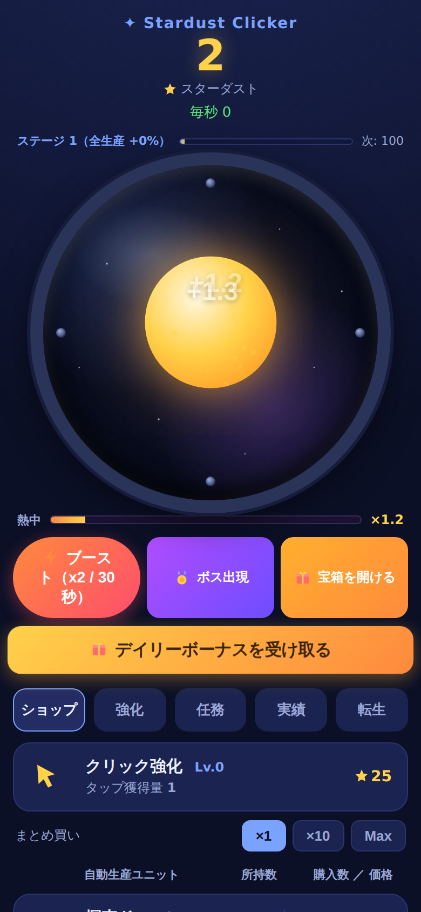
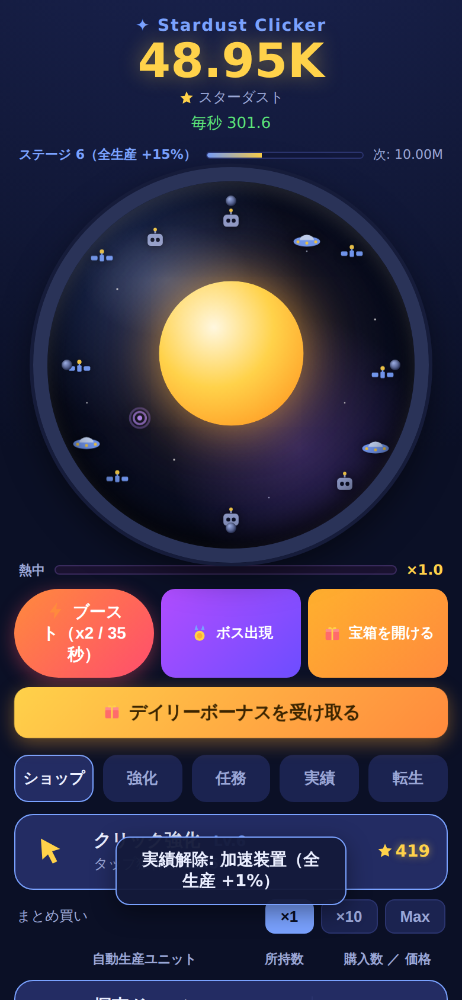
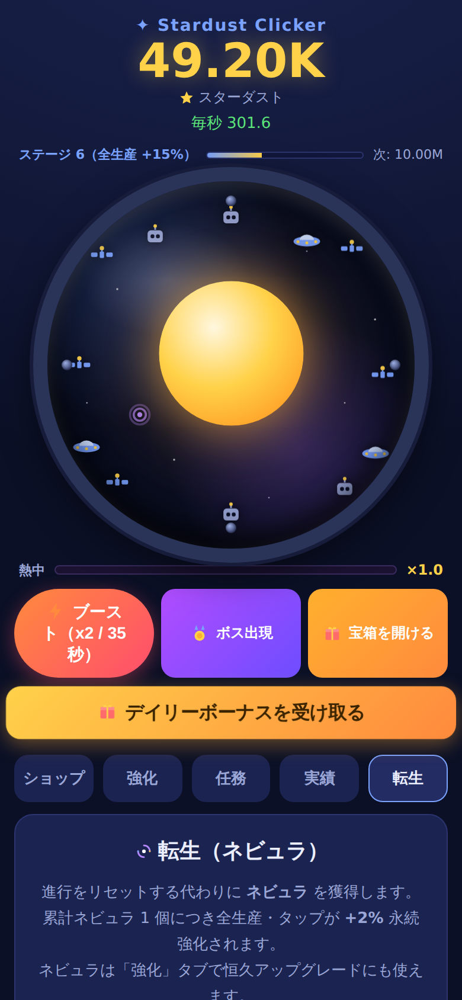
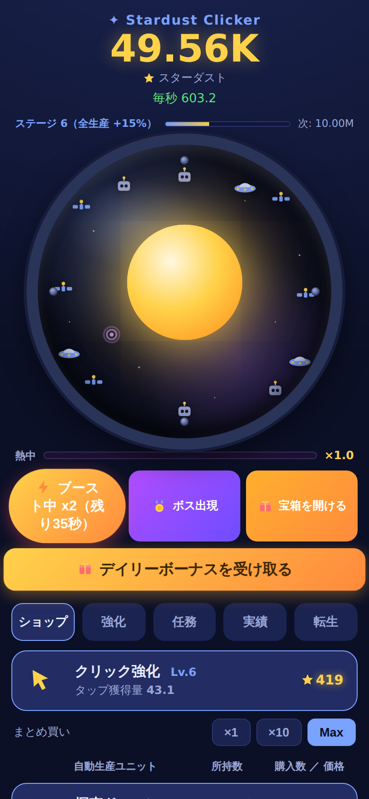
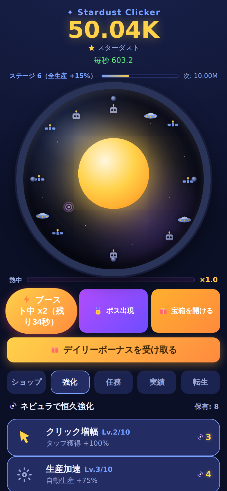
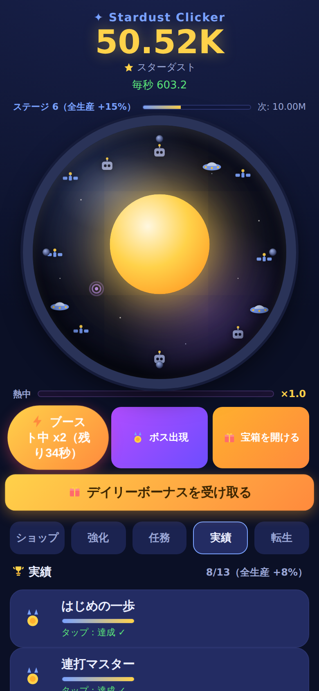
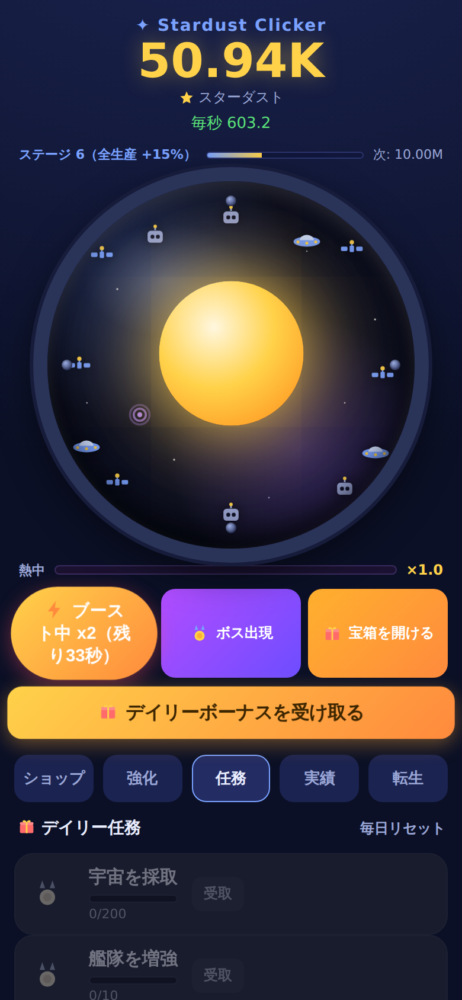
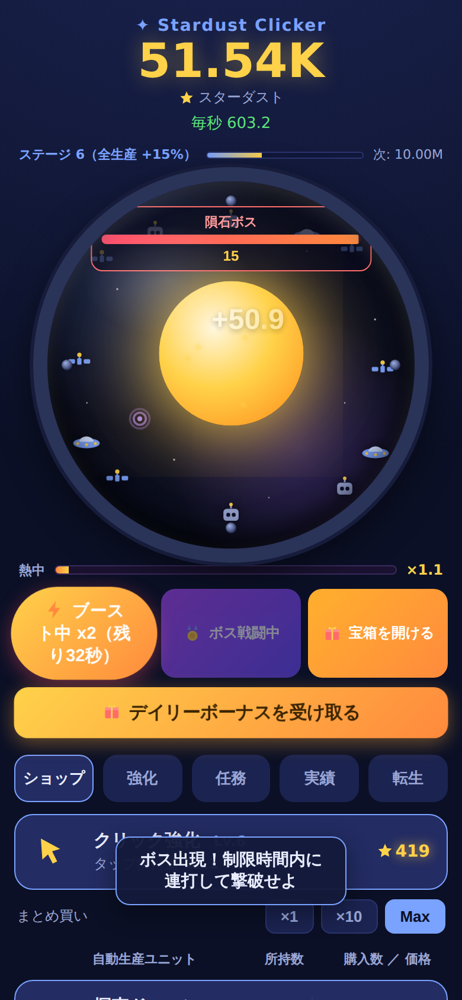

# Stardust Clicker 🌟

星屑（スターダスト）を集める放置クリッカーゲームの **MVP**。
「市場調査 → 要素抽出 → 最小限のアプリ作成」の流れで開発。

## ドキュメント

| ファイル | 内容 |
|----------|------|
| [docs/01_market_research.md](docs/01_market_research.md) | 市場調査（市場規模・成長性・コアメカニクス・出典） |
| [docs/02_requirements.md](docs/02_requirements.md) | 要素抽出と**技術選定の論拠**、受け入れ条件 |

## 技術スタック（選定理由は docs/02 を参照）

- **HTML + CSS + Vanilla JavaScript**（依存ゼロ）
- **PWA**（manifest + Service Worker）でスマホにインストール可・オフライン動作
- 採用理由の要点: ①「最小限」に最短到達 ②本環境で実動作検証できる唯一の手段
  ③ PWA でスマホアプリ要件を満たす ④クリッカーは UI 主体で Web と好相性

## 実装した機能（MVP / 市場調査の要素 F1–F7）

- **F1 タップ獲得** — 中央の星をタップして採取＋フローティング演出
- **F2 クリック強化** — タップ獲得量をアップグレード
- **F3 自動生産ユニット** — 5 種（価格は所持数で指数上昇）
- **F4 放置報酬** — 離席時間に応じて獲得（上限8時間）＋復帰モーダル
- **F5 桁表記** — K / M / B / T … のサフィックス
- **F6 セーブ/ロード** — localStorage に自動保存・自動復元
- **F7 転生（ネビュラ）** — 進行リセットと引き換えに永続 +2%/個ブースト
- **F8 まとめ買い** — ×1 / ×10 / Max を切替（Max は所持額で買える最大数を一括購入）
- **F9 タップブースト** — 一定時間 全生産・タップが ×2、終了後クールダウン
- **F10 実績** — 11種を自動判定、解除ごとに全生産 +1%（トースト通知）
- **F11 デイリーボーナス** — 1日1回・連続日数で報酬増（最大×7）
- **F12 演出強化** — 独自SVGアイコン(絵文字不使用)/効果音(WebAudio)/触覚(Vibration)/クリティカル(5%で×7)/タップ時パーティクル・数値ポップ・購入フラッシュ・達成/デイリーのバースト/設定でON/OFF
- **F10+ 実績の達成率表示** — 各実績に進捗バーと「現在値/目標値」(例 20/50)を表示
- **F13 恒久アップグレード** — ネビュラで4系統(クリック/生産/ブースト/放置)を強化
- **F14 コックピット／艦隊表示** — タップ部を宇宙船の舷窓に。宇宙背景＋中央の太陽、保有数に応じて艦隊（ドローン等）が窓内に出現
- **F15 コンボ（熱中ゲージ）** — 連打でゲージが溜まりタップ倍率UP（最大×3）、止めると減衰
- **F16 ボス／タイムアタック** — 制限時間内に連打で撃破→報酬。撃破で宝箱も解放
- **F17 宝箱／ガチャ** — クールダウンで開封、レア度別ランダム報酬（演出付き）
- **F18 ステージ進行＋デイリー任務** — 累計獲得でステージUP（恒久+3%/段）＋日替わり任務

## スクリーンショット

| 初期状態 | 進行後（コックピット＋艦隊） | 転生 | QoL（Max買い＋ブースト） |
|---|---|---|---|
|  |  |  |  |

| 恒久アップグレード（強化） | 実績 | デイリー任務 | ボス戦 |
|---|---|---|---|
|  |  |  |  |

> Chromium（iPhone 相当 390×844）で実配信・操作して撮影。
> 撮影スクリプト: [docs/screenshots/shot.mjs](docs/screenshots/shot.mjs)（Playwright）

## 動かし方（ローカル）

ビルド不要。静的配信するだけ:

```bash
# リポジトリのルートで
python3 -m http.server 8000
# ブラウザで http://localhost:8000 を開く
```

スマホで遊ぶ場合は、同一ネットワークの PC で上記を起動し、
スマホのブラウザから `http://<PCのIP>:8000` を開く →
ブラウザメニューの「ホーム画面に追加」で PWA としてインストール可能。

## 今後の拡張（MVP 対象外）

- 収益化（IAP / リワード広告）、デイリーボーナス、実績・ミッション
- プッシュ通知による放置報酬の再訪促進
- ストア配信が必要になった段階で **Capacitor** によるネイティブ化、または
  **Flutter** での再実装（コア計算式は言語非依存でそのまま移植可）
